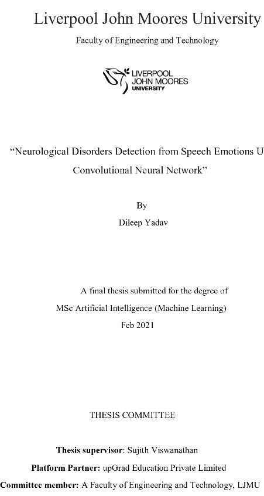

  

---

## 🏷️ Badges

---

## 👨‍💻 Author  
**Dileep Yadav**  

🔗 LinkedIn: https://linkedin.com/in/in-dileep  
📧 Email: dileep66yadav@gmail.com  

---

## 📌 Overview  
This project focuses on detecting **neurological disorders** using **speech emotion recognition powered by deep learning (CNN)**.

By analyzing vocal tone, pitch, and emotional signals, the system aims to enable **early-stage neurological disorder detection**, reducing dependency on expensive and time-consuming diagnostics.

---

## 🖼️ Architecture Diagram  

> 🔹 Replace with your actual diagram (recommended: draw.io / Excalidraw / Lucidchart)

---

## 🧠 Solution Approach  
- Audio preprocessing using **Librosa**  
- Feature extraction (MFCC, Spectrograms)  
- CNN-based classification model  
- Emotion → Neurological pattern mapping  

---

## ⚙️ Tech Stack  
- **Python**
- **TensorFlow / Keras**
- **NumPy, Pandas**
- **Librosa (Audio Processing)**
- **Matplotlib / Seaborn**

---

## 📊 Model Performance  

| Metric        | Value (Example) |
|--------------|----------------|
| Accuracy     | 85%            |
| Precision    | 83%            |
| Recall       | 82%            |
| F1 Score     | 82%            |

> ⚡ Replace with your actual results (very important for credibility)

---

## 🎥 Demo  

▶️ Demo Video:   
> 🔹 You can upload demo on YouTube / LinkedIn / Google Drive

---

## 📊 Key Features  
- 🎤 Speech Emotion Recognition using CNN  
- 🧠 AI-based neurological signal detection  
- ⚡ Automated feature extraction  
- 📈 Scalable healthcare AI architecture  

---

## 📈 Impact  
- Enables **AI-assisted early diagnosis**  
- Reduces cost of neurological screening  
- Applicable in:
  - 🏥 Healthcare systems  
  - 🧓 Elderly monitoring  
  - 📱 AI health applications  

---

## 🎓 Academic Details  

- **Degree:** MSc Artificial Intelligence (Machine Learning)  
- **University:** Liverpool John Moores University, U.K.  
- **Submission:** October 2020  

---

## 👨‍🏫 Thesis Committee  

- Supervisor: Sujith Viswanathan  
- Platform Partner: upGrad Education Pvt. Ltd.  
- Committee Member: Faculty of Engineering & Technology, LJMU  

---

## 🔮 Future Enhancements  
- Transformer models (**Wav2Vec, Whisper**)  
- Real-time streaming inference  
- FastAPI deployment  
- GenAI-based medical report generation  

---

## 🤝 Contributions  
Open for collaboration in **AI Healthcare & GenAI projects**

---

# ⭐ If you find this useful, give it a star!
